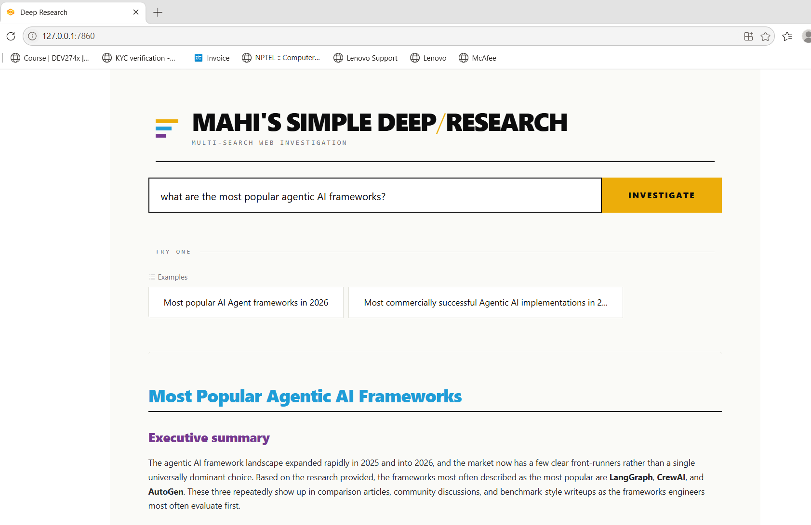

# Simple Deep Research Agent

A multi-agent AI research application that searches the web,
analyses information from multiple sources, and produces a
structured research report.

## App Preview

## How It Works

1. The user enters a research question.
2. A planner agent determines what searches need to be performed.
3. Search agents investigate the topic using web search.
4. The research manager coordinates the agents and collects the results.
5. A writer agent turns the findings into a structured report.
6. Progress updates are streamed to the Gradio interface.

## Tech Stack

- Python
- OpenAI Agents SDK
- Gradio
- Pydantic
- Web Search

## Demo

Happy to provide a live demo and walk through how the application works.
